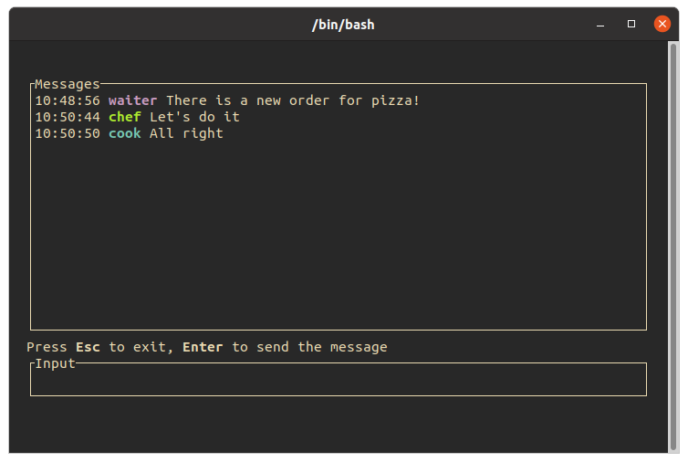

# rust-mqtt-chat

This repo contains simple MQTT chat with payload encryption written in Rust. This app was made mainly as a TDD exercise for me, so keep that in mind when using it.

> a bug is not an error in logic; it is a test that was not written




## Setup

Clone this repo and run `cargo build` to compile.

## Usage

```
rust mqtt chat 0.1.0
Payload encrypted chat over mqtt (written in rust)

USAGE:
    actor-model-chat --password <password> --room <room> --server <server> --user <user>

FLAGS:
    -h, --help       Prints help information
    -V, --version    Prints version information

OPTIONS:
    -p, --password <password>    Rooms password [env: PASSWORD=]
    -r, --room <room>            Name of chat room to connect to [env: ROOM=]
    -s, --server <server>        Url to mqtt server [env: SERVER=]
    -u, --user <user>            User name [env: USER=damian]
```

For example:
```bash
cargo run --release -- --server tcp://localhost:1883 --room kitchen --password pizza --user chef
```

## License

This project is licensed under the MIT License - see the [LICENSE](LICENSE) file for details
